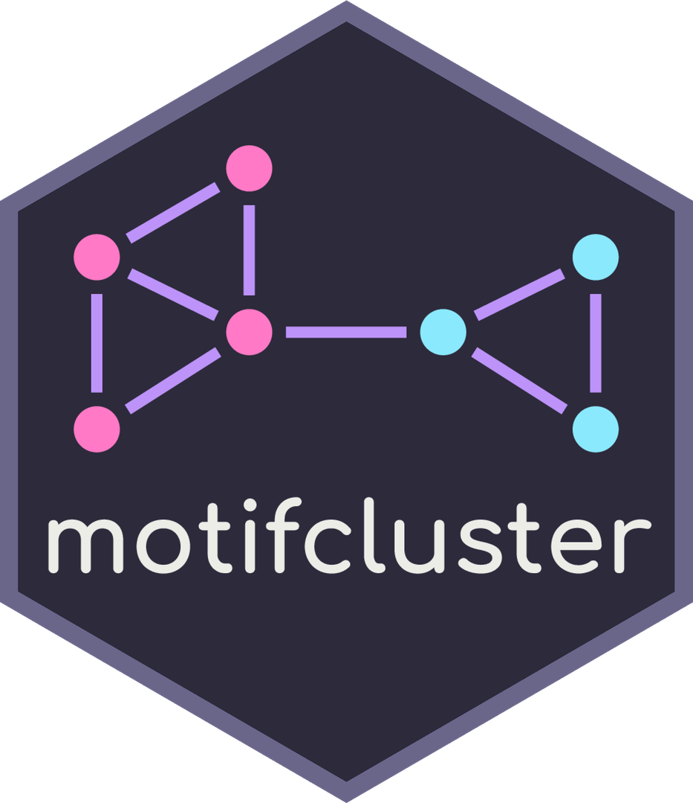

# motifcluster 


[](https://travis-ci.com/github/WGUNDERWOOD/motifcluster)
[](https://motifcluster.readthedocs.io/en/latest/)
[](https://coveralls.io/github/WGUNDERWOOD/motifcluster)
[](https://codecov.io/gh/WGUNDERWOOD/motifcluster)
[](https://www.gnu.org/licenses/gpl-3.0)


Motif-based spectral clustering of weighted directed networks

## Introduction

This repository provides implementations of motif-based spectral clustering
of weighted directed networks in R and in Python.
This code is based on methods detailed in
[Underwood, Elliott and Cucuringu, 2020],
which is available at
[arXiv:2004.01293](https://arxiv.org/abs/2004.01293).
These packages provide the capability for:

- Building motif adjacency matrices
- Sampling random weighted directed networks
- Spectral embedding with motif adjacency matrices
- Motif-based spectral clustering

The methods are all designed to run quickly on large sparse networks,
and are easy to install and use.

### Branches

The master branch contains stable versions.
The develop branch may be unstable,
and is for development purposes only.

### Authors

  - [William George Underwood](https://wgunderwood.github.io/),
    Princeton University
    (Python, R, maintainer)
  - [Andrew Elliott](https://www.turing.ac.uk/people/researchers/andrew-elliott),
    The Alan Turing Institute
    (Python)

### License

This repository,
along with its included R package and Python package,
are all licensed under
[GPLv3](http://gplv3.fsf.org/).


## R package

The R package "motifcluster" is in the [R](./R/) directory.

### Installation

The R package can be installed from the GitHub master branch with:

```
install_github("wgunderwood/motifcluster/R")
```

### Dependencies

The R package has the following dependencies, available on CRAN:

- igraph
- LICORS
- Matrix
- RSpectra

### Documentation

The package's manual and an instructional vignette are in the
[R/doc](./R/doc) directory.
R documentation files are provided for each function
available in the package.


## Python code

The Python package "motifcluster" is in the
[python](./python/) directory.

### Installation

The Python package can be installed from PyPI with:

```
pip install motifcluster
```

### Dependencies

The Python package has the following dependencies,
available on PyPI:

- Networkx
- Numpy
- Scipy
- Scikit-learn

### Documentation

Full documentation is available at
[motifcluster.readthedocs.io](https://motifcluster.readthedocs.io/).
The package's manual is also in the
[python/doc](./python/doc/) directory.
